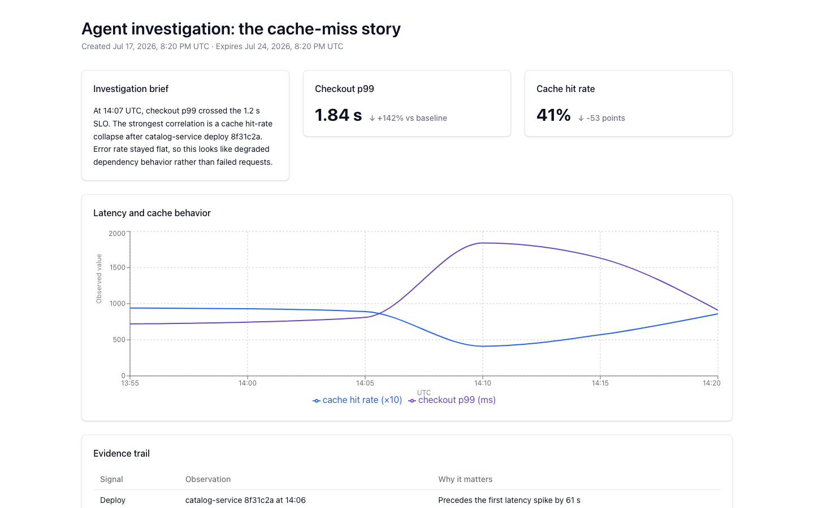

# Agent: a multi-tenant AI SRE on AWS Bedrock AgentCore

**An archived reference implementation of a multi-tenant AI SRE for Slack on AWS Bedrock AgentCore.**

> [!IMPORTANT]
> Agent is no longer an active product. This repository is published as a learning resource and creative systems-design example. It is not maintained as a hosted service, has not been independently security-audited, and is not production-ready without substantial review.

Agent started with a simple provocation: what if the alert in Slack could become the investigation, the proposed fix, and the artifact the team shares afterward?

Most incident bots stop at a summary. Agent was designed to carry the thread further:

1. An alert lands in Slack.
2. The agent assembles tenant-specific context, channel history, memory, and runbooks.
3. AgentCore Gateway tools pull evidence from observability and operational systems.
4. GitHub tools correlate symptoms with code, commits, and recent deploys.
5. A one-shot Fargate sandbox can work on an isolated branch and open a pull request.
6. The agent can turn results into a short-lived interactive dashboard and post the link back to the thread.

That complete arc—**alert → evidence → code → change → shared understanding**—is the creative center of the project.

## Architecture

Agent deliberately separates transport from reasoning. The bridge owns Slack and fast acknowledgements; the agent owns tools, memory, investigation, and actions.

~~~mermaid
flowchart LR
    Slack["Slack alert, question, or incident thread"] --> Bridge["Bridge FastAPI, OAuth, tenant resolution, async replies"]
    Bridge --> Runtime["AgentCore Runtime Strands agent"]
    Runtime --> Bridge
    Bridge --> Slack

    Config["DynamoDB tenant config, audit, spend, jobs"] <--> Runtime
    Memory["AgentCore Memory tenant and channel namespaces"] <--> Runtime
    Runtime <--> Gateway["AgentCore Gateway observability, docs, ticketing, BYO tools"]
    Runtime <--> GitHub["GitHub App code search, files, symbols, commits"]
    Runtime --> Sandbox["One-shot Fargate sandbox isolated branch, agent loop, pull request"]
    Runtime --> Dashboard["Ephemeral dashboard spec charts, tables, stats, text"]
    Dashboard --> Web["Next.js renderer unguessable bearer URL, 7-day TTL"]
~~~

The runtime hydrates a fresh <code>TenantConfig</code> for every invocation. A tenant can select its model, persona, catalog tools, Gateway integrations, memory behavior, channel personas, skills, escalation routes, cost caps, and connected codebases without changing the shared agent deployment.

## What is here

This is a reference tree, not a claim that every subsystem is equally mature.

| Capability | Status in this repository | Important limit |
|---|---|---|
| Slack transport, OAuth, signature checks, retry dedup, async reply path | Implemented and covered by bridge tests | You must create and configure your own Slack app |
| Per-tenant prompts, tools, channel personas, skills, escalation, cost caps, audit | Implemented | Isolation is enforced by application code over shared AWS resources; review it for your threat model |
| AgentCore Runtime and Memory integration | Implemented | Requires your AWS account, model access, IAM, and memory provisioning |
| AgentCore Gateway integrations | Implemented as connector and provisioning patterns | Shared-Gateway tool metadata is not tenant-private; use per-tenant Gateways if target names or schemas are sensitive |
| Incident/runbook/on-call/deploy skills | Implemented as built-in prompt-driven workflows | Output quality depends on connected data and the selected model |
| GitHub code and commit correlation | Implemented through a GitHub App | Requires installation permissions, careful repository scoping, and an operator-approved installation-to-tenant binding |
| Autonomous PR sandbox | Experimental reference; disabled by default | The current worker exposes in-task credentials to model-generated shell commands. Use only with disposable credentials while redesigning the trust boundary; see the sandbox warning |
| Ephemeral interactive dashboards | Experimental reference implementation | Links are bearer capabilities: anyone with the URL can view until the 7-day expiry |
| Onboarding, workspace settings, and operator views | Implemented reference UI | Authentication and RBAC are not a finished multi-user product |
| Discord/Teams transports, billing, marketplace, durable dashboards | Not implemented | These remain design directions, not hidden features |

No public Agent endpoint or cloud environment is part of this archive.

## Why it may be useful

The interesting reusable patterns are larger than this particular product:

- A thin, transport-only Slack bridge that acknowledges within Slack's deadline and dispatches agent work asynchronously.
- One shared runtime whose behavior is hydrated from tenant configuration on every invocation.
- Tenant-whitelisted in-process tools plus customer-specific tools behind AgentCore Gateway.
- Channel-aware context assembly, memory namespaces, runbook triggers, escalation routes, and bot-to-bot policy.
- Code investigation and long-running write actions split across trust boundaries.
- Healthy/busy lifecycle tracking for background work.
- Audit and spend records designed so observability failures never break the user path.
- Conversation-native output that can become a temporary interactive artifact.

## Try it locally — no cloud account required

The shortest path to the interesting part of Agent is three commands:

~~~bash
make doctor
make setup
make demo
~~~

Open the printed URL to see a realistic investigation dashboard backed by the
real FastAPI bridge and Next.js renderer. The sample tells a small incident
story—latency spike, correlated cache collapse, evidence trail, and recommended
mitigation—without requiring AWS credentials, AgentCore, Bedrock, Slack,
Docker, or an API key. Press <kbd>Ctrl</kbd>+<kbd>C</kbd> once to stop both
processes cleanly.

<code>make setup</code> installs all four isolated Python environments and all
three Node environments from checked-in lockfiles. It also creates
<code>bridge/.env.local</code> and
<code>onboarding/.env.local</code> from their tracked examples, gives both the
same cryptographically random local session secret, and sets their mode to
<code>0600</code>. Existing env files are never replaced; if their secrets
disagree, setup stops with a repair instruction instead of guessing.

You need Git, Python **3.13**, [uv](https://docs.astral.sh/uv/), Node.js **22+**,
and npm. <code>make doctor</code> checks each one, distinguishes required tools
from optional cloud tooling, and prints an exact install path for anything
missing. The scripts support <code>--help</code> and work with the Bash versions
shipped by current macOS and mainstream Linux distributions.
Make is only a convenience wrapper: if it is not installed, run the matching
<code>./scripts/doctor.sh</code>, <code>./scripts/setup.sh</code>,
<code>./scripts/demo.sh</code>, or <code>./scripts/check.sh</code> entrypoint
directly.

To prove the demo can boot and shut down without opening a browser:

~~~bash
scripts/demo.sh --check
~~~

## Validate the repository

After <code>make setup</code>, one command runs the local equivalents of the CI
gates: service and synthetic-incident Python suites, the sandbox tests,
onboarding authentication tests and production build, generated CDK tests and
formatting, every hand-authored CDK synth variant, shell/tooling tests, an
optional local gitleaks scan, and a no-cloud service startup check.

~~~bash
make check
~~~

For a faster edit loop, <code>scripts/check.sh --quick</code> skips CDK synth and
the live demo startup. Neither command deploys resources or calls AWS, Slack, or
GitHub APIs. The check also works from GitHub source archives, where there is no
Git index: generated local env files, dependencies, and build output are kept
out of the source-only secret scan.

## Prerequisites for the full AgentCore path

For the AgentCore loop or an AWS deployment:

- The [Amazon Bedrock AgentCore CLI](https://github.com/aws/agentcore-cli), installed with <code>npm install -g @aws/agentcore@0.24.1</code>
- AWS CLI v2 and credentials for your own account
- AWS CDK v2
- Access to a compatible Bedrock model in your chosen region
- A Slack app if you want to exercise the real transport

AWS authentication uses the standard AWS CLI/SDK credential chain, including
named profiles, SSO sessions, environment credentials, and workload roles. One
selected region is threaded through AgentCore, CDK, the bridge, deployment
scripts, and the manual GitHub Actions release jobs. The fallback for examples
and credential-free synth is <code>us-west-2</code>.

This does not mean every AWS partition and region has the same service set. The
full reference path supports any commercial AWS account in a region accepted
by the pinned AgentCore CLI where Runtime, the chosen Bedrock model, Gateway,
Memory, and the other enabled features are available. The exact release
allowlist is tracked in
[<code>scripts/agentcore_regions.txt</code>](./scripts/agentcore_regions.txt);
it is intentionally narrower than the set of syntactically valid AWS region
names. The CDK policies are partition-aware and can synthesize
for GovCloud, but the default global Bedrock model and optional AgentCore
features must be replaced or disabled there. AWS China is not a supported full
deployment target; neither are isolated or other sovereign partitions outside
commercial AWS and GovCloud. Check the current
[AgentCore region matrix](https://docs.aws.amazon.com/bedrock-agentcore/latest/devguide/agentcore-regions.html)
before spending money. A region choice is not, by itself, a privacy or
compliance guarantee.

## Full local AgentCore loop

Local mode uses JSON fixtures in <code>examples/</code> for tenant data and workspace mapping. The two local flags have intentionally different names:

- Agent: <code>AGENT_LOCAL_STORES=1</code>
- Bridge: <code>LOCAL_DEV=1</code>

The AgentCore CLI reserves <code>LOCAL_DEV</code> internally, so using it as the agent's store flag causes confusing behavior.

Run <code>make setup</code> first. The service directories still have independent
environments; do not import the bridge package from the agent or vice versa.

AgentCore requires an ignored, developer-specific deployment target file. Do
not edit account IDs into tracked configuration. Select the same profile and
region you will use for development, verify the live STS identity and AgentCore
control plane, and generate the target from that identity:

~~~bash
export AWS_PROFILE=my-sandbox-profile  # omit for the default credential chain
export AWS_REGION=eu-west-1
make aws-doctor
make aws-configure
~~~

<code>make aws-doctor</code> is read-only. <code>make aws-configure</code> writes
only <code>coreAgent/agentcore/aws-targets.json</code>, with mode 0600. It refuses
to replace a different account or region unless you explicitly pass
<code>AWS_CONFIGURE_ARGS="--force"</code>. The script also reports whether the
selected account/region has been CDK-bootstrapped.
AWS CLI calls time out after 30 seconds by default; set
<code>AGENTCORE_AWS_CLI_TIMEOUT_SECONDS</code> when an SSO or credential helper
needs a different bound.
The preflight rejects regions outside the pinned CLI's release allowlist before
contacting STS or writing the target file.

Then start three terminals from the repository root:

~~~bash
# Terminal 1 — agent on :8080
cd coreAgent
AGENT_LOCAL_STORES=1 agentcore dev --logs
~~~

~~~bash
# Terminal 2 — bridge on :8000
cd bridge
# make setup already created .env.local with local routing + shared secret.
uv run uvicorn bridge.main:app --reload --port 8000 --env-file .env.local
~~~

~~~bash
# Terminal 3 — Next.js UI on :3000
cd onboarding
# make setup already created .env.local with the shared local secret.
npm run dev
~~~

With the bridge in <code>LOCAL_DEV=1</code>, its debug transport is available:

~~~bash
curl -X POST http://localhost:8000/debug/message \
  -H 'Content-Type: application/json' \
  -d '{"workspace_id":"demo-ws","user_id":"u1","text":"Investigate the latest alert"}'
~~~

That final request invokes the model and therefore needs valid AWS credentials and Bedrock access. For a browserless smoke test that starts all three services but skips the live Bedrock request:

~~~bash
scripts/smoke.sh --no-agent
~~~

The smoke harness still requires the AgentCore CLI. It temporarily updates local
fixtures and restores them on exit. For the zero-cloud, two-service experience,
use <code>make demo</code> instead.

## Synthetic incident lab

The repository includes two ways to explore the idea with synthetic data:

- [<code>seed/</code>](./seed/README.md) creates a focused N+1-query incident across Datadog metrics and Slack threads.
- [<code>scripts/testenv/</code>](./scripts/testenv/README.md) builds a larger, persistent Acme-shaped tenant with channels, history, runbooks, codebases, and repeatable alert scenarios.

Both labs write to external systems. Use disposable workspaces, accounts, repositories, and narrowly scoped credentials. Inspect the scripts before running them; the larger test environment is intentionally closer to a real deployment than a unit-test fixture.

## Deploying the reference stack

There is no single safe <code>deploy everything</code> command. A real deployment crosses several security and billing boundaries:

1. Review and synthesize the shared data and IAM stacks in [<code>infra/data/</code>](./infra/data/README.md).
2. Configure and deploy the AgentCore runtime from [<code>coreAgent/</code>](./coreAgent/README.md); the runtime source is [<code>coreAgent/app/coreAgent/</code>](./coreAgent/app/coreAgent/).
3. Create your own Slack app from [<code>bridge/slack_manifest.json</code>](./bridge/slack_manifest.json), then configure OAuth, signing, redirect, and event URLs. Set <code>CERTIFICATE_ARN</code> and <code>DOMAIN_NAME</code>; the production workflow refuses to deploy without them. Route the bridge callback and onboarding UI through that one HTTPS public origin so the host-scoped HttpOnly onboarding cookie survives the redirect without putting a bearer in the URL.
4. If you enable GitHub App code access, explicitly bind each numeric installation ID to the intended tenant through the privileged approval endpoint. Tenant sessions cannot create or change <code>codebases.github_installation_id</code>.
5. Provision Gateway targets and credentials for only the integrations you intend to expose.
6. Treat the Fargate PR sandbox in [<code>infra/sandbox/</code>](./infra/sandbox/) as hostile code execution and harden it before enabling <code>propose_pr</code>.
7. Set an HTTPS <code>DASHBOARD_BASE_URL</code> if you enable dashboards.

For GitHub Actions deployment, set the repository variable
<code>AWS_REGION</code> to the same region as the configured OIDC role and every
regional ARN. It defaults to <code>us-west-2</code>. The workflow rejects a
runtime ARN from a different account, partition, or region, and CDK validates
the supplied AgentCore, ACM, ECS, and Secrets Manager ARNs before synthesis.
Because the [AWS control-plane API](https://docs.aws.amazon.com/bedrock-agentcore-control/latest/APIReference/API_GetAgentRuntime.html)
and [runtime developer guidance](https://docs.aws.amazon.com/bedrock-agentcore/latest/devguide/runtime-security-best-practices.html)
currently contain both versioned
<code>agent/&lt;uuid&gt;:&lt;version&gt;</code> and legacy
<code>runtime/&lt;id&gt;</code> AgentCore ARN resources, discovery and validation
accept both shapes while still requiring the live control-plane ID and version.

The checked-in helper performs the GitHub account check and exclusive tenant
binding without putting the operator secret on the command line:

~~~bash
read -rsp 'Operator secret: ' ADMIN_SECRET
printf '\n'
export ADMIN_SECRET
python3.13 scripts/approve_github_installation.py \
  tenant-id 123456 expected-github-owner \
  --bridge-url https://agent.example.com
unset ADMIN_SECRET
~~~

Agent-side <code>manage_config</code> writes are also read-only by default because
<code>admin_user_ids</code> starts empty. If you intentionally enable them, add
the exact Slack user IDs through reviewed operator tooling or directly to the
tenant's DynamoDB configuration—not through the tenant PATCH API—and audit that
change like any other privilege grant.

> [!WARNING]
> Pull requests and pushes run validation only. Cloud deployment is gated behind a manual GitHub Actions dispatch with an explicit <code>deploy_production=true</code> input. The PR sandbox additionally requires <code>deploy_experimental_sandbox=true</code>, remains unsafe for production even when enabled, and should use only disposable credentials. Review the workflow and IAM scope before adding credentials to a fork.

### Cost and cleanup

Deploying this architecture can create billable AgentCore, Bedrock, Gateway, ECS/Fargate, load balancer, CloudWatch, Secrets Manager, ECR, and DynamoDB usage. Model calls and sandbox runs add variable cost.

Some DynamoDB resources use retention policies. Destroying a CDK stack may intentionally leave data behind, so verify both CloudFormation state and the underlying resources when cleaning up. Set AWS Budgets and service-level caps before testing with real traffic.

### Security boundaries to revisit

Before any production use:

- Replace every example secret and rotate any credential ever used during development.
- Keep secrets in a secret manager; never commit <code>.env</code> files, Slack tokens, API keys, GitHub keys, or deployment state.
- Validate Slack signatures and keep the debug route disabled outside <code>LOCAL_DEV=1</code>.
- Keep bridge OAuth callbacks and onboarding on one HTTPS public origin; never put onboarding session tokens in URLs.
- Re-audit tenant authorization for every DynamoDB, Gateway, Slack, memory, dashboard, and GitHub access path.
- Treat each GitHub App installation ID as an operator-approved tenant binding, not a tenant-editable setting.
- Narrow IAM policies and GitHub App permissions to the resources each component actually needs.
- Add explicit human approval and stronger isolation around model-generated code changes.
- Do not place sensitive data in ephemeral dashboards; their URLs are bearer credentials.
- Review [<code>SECURITY.md</code>](./SECURITY.md) and run your own threat model.

## Repository map

~~~text
.
├── bridge/                         Slack/OAuth transport and AgentCore client
├── coreAgent/
│   ├── agentcore/                  AgentCore CLI configuration
│   └── app/coreAgent/              Strands runtime, tools, memory, tenant config
├── onboarding/                     Next.js onboarding, workspace, ops, dashboards
├── workers/gateway_interceptor/    Gateway JWT and tenant-isolation interceptor
├── infra/
│   ├── data/                       Hand-authored CDK: data, services, Gateway, IAM
│   └── sandbox/                    One-shot agentic PR worker + frozen Python lock
├── examples/                       Local tenant and workspace fixtures
├── seed/                           Focused synthetic incident generator
└── scripts/testenv/                Persistent integration-testing lab
~~~

The authoritative tenant schema is <code>coreAgent/app/coreAgent/tenant.py</code>. Its API and UI mirrors live in the bridge and onboarding packages; changes must remain synchronized.

## Project status

Agent is archived. Issues and pull requests may be useful to future readers, but there is no roadmap, hosted service, support SLA, or promise of dependency updates.

- Read [<code>NORTH_STAR.md</code>](./NORTH_STAR.md) for the archived product thesis.
- See [<code>CONTRIBUTING.md</code>](./CONTRIBUTING.md) before proposing a change.
- Read [<code>SUPPORT.md</code>](./SUPPORT.md) for the archive's support boundaries.
- Report vulnerabilities through [<code>SECURITY.md</code>](./SECURITY.md).
- Review the [<code>CHANGELOG.md</code>](./CHANGELOG.md) for the open-source archive snapshot.

Released under the [MIT License](./LICENSE).
